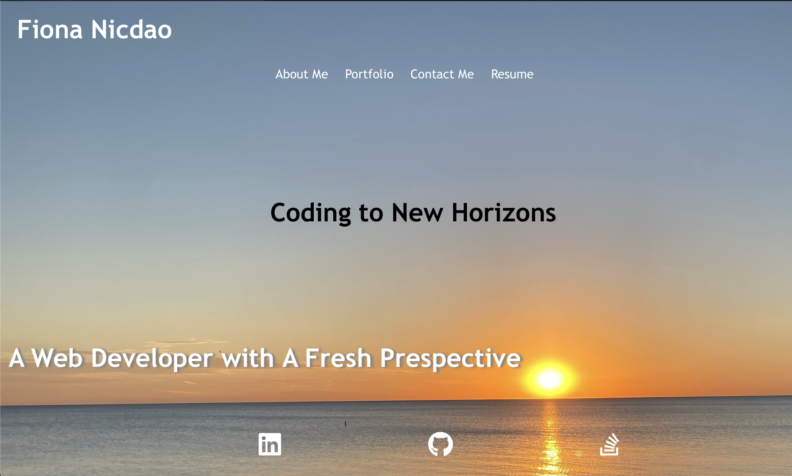
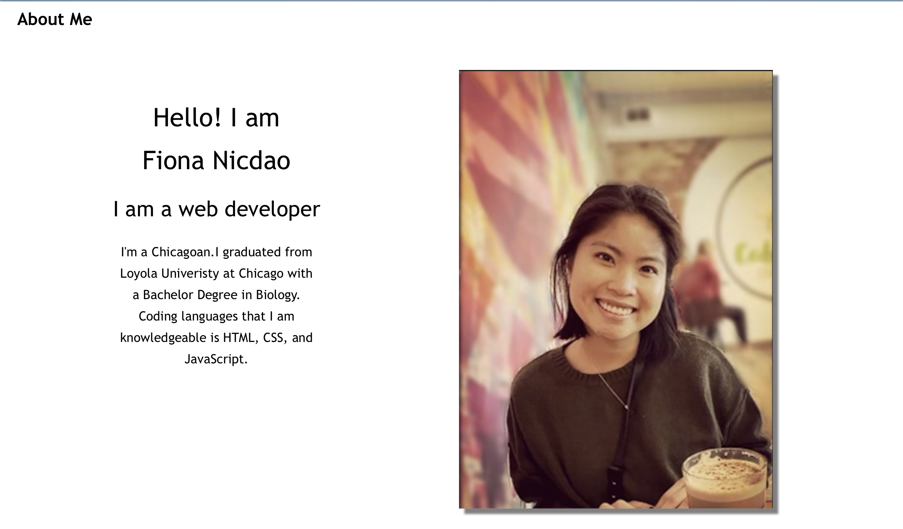
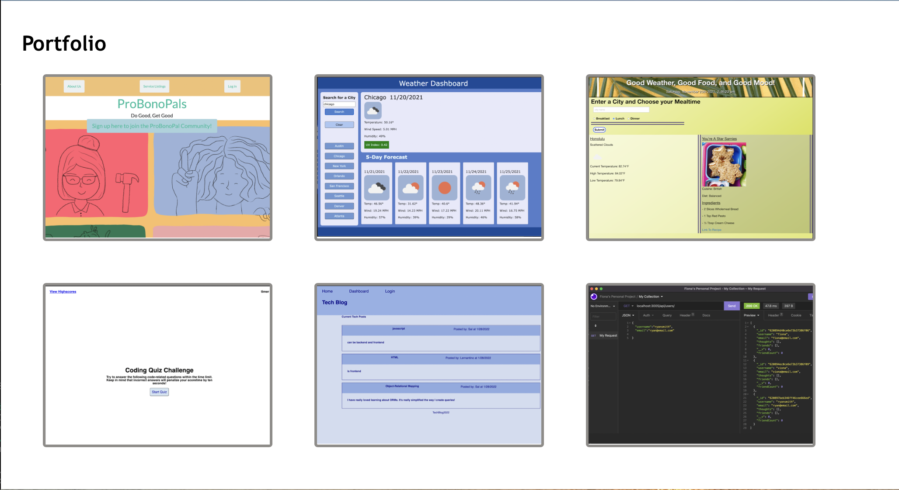

# portfolio-react

Week 20 React.js
# Fiona Nicdao Porfolio Webpage

## Purpose 
The purpose for this project is to have a professional portfolio webpage with work samples to show potential employers and be an avenue for employers to contact me. 

## Objective 
- must be a react.js application
- have a single-page application portofolio for a web developer
- page must include a header , section for content, anda footer
- navigation to different sections: About Me, Portfolio, Contact, and Resume 
- About me section must have a photo and a short bio 
- Portfolio section must have 6 applications with links to deployed application and Github repository
- Contact section must have a name, email, message parts with notification for required fields and valid emails,
- Resume section must have downloadable resume and list of developer proficienies

Link to [portfolio webpage](https://fiona1nicdao.github.io/portfolio-react/)

## Webpage Preview 
This is the view on chrome browser. 

## License 
  This project is licensed under the [MIT License](https://opensource.org/licenses/MIT).

## Credit
Joshua Kuruvilla for help with background image css.

codebucks27 for [validation](https://dev.to/codebucks/form-validation-in-reactjs-by-building-reusable-custom-hook-1bg7) help.

[w3schools.com](https://www.w3schools.com/howto/howto_css_image_overlay.asp) for help with overlap image cards.

Brianna Woodruff and Josshy Olea for help with emailjs.com

mongo [image](https://github.com/FortAwesome/Font-Awesome/issues/16179)

mysql [image](https://github.com/FortAwesome/Font-Awesome/issues/8234)

graphQL [image](https://en.wikipedia.org/wiki/GraphQL#/media/File:GraphQL_Logo.svg)
## Questions

 For any further assistance, you may contact me at:
   * Github: [fiona1nicdao](<https://github.com/fiona1nicdao>)

